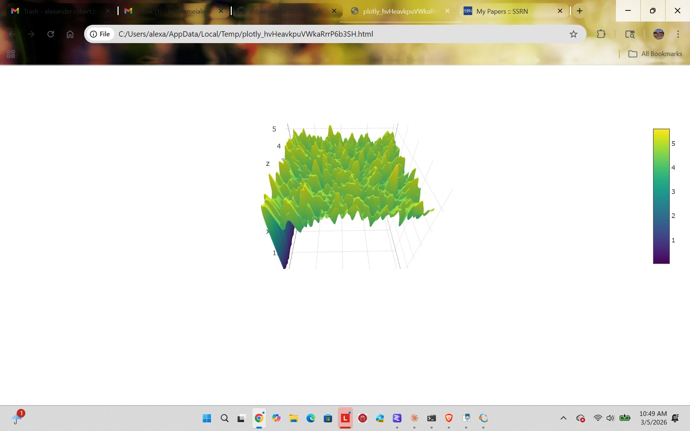

# picalc

A Rust learning project that computes digits of π using a spigot algorithm, maps them onto a 2D landscape, applies IIR low-pass filtering, and renders the result as an interactive 3D surface plot using Plotly.



## Overview

The digits of π, when laid out on a 2D grid and treated as height values, form a landscape of essentially random noise — reflecting the conjectured normality of π. This project visualizes that landscape after applying a 2D Butterworth low-pass filter to smooth the surface, producing the terrain-like plot shown above.

## Modules

- **`config.rs`** — Grid dimensions and total digit count
- **`spigot.rs`** — Computes π digits using the Rabinowitz-Wagon spigot algorithm
- **`landscape.rs`** — Constructs the 2D grid, applies IIR filtering, and renders the 3D surface
- **`main.rs`** — Entry point

## How It Works

1. The spigot algorithm generates `NUM_ROWS × NUM_COLS` digits of π
2. Digits are arranged into a 2D grid where each value (0–9) becomes a height value
3. A 2nd-order Butterworth IIR low-pass filter is applied row-wise then column-wise
4. The filtered landscape is rendered as an interactive 3D surface using Plotly (Viridis colormap)

## Dependencies

```toml
[dependencies]
plotly = "0.9"
```

## Running

```bash
cargo run --release
```

The plot will open automatically in your default browser as a local HTML file.

## Configuration

Edit `config.rs` to change the grid size:

```rust
pub const NUM_ROWS: usize = 200;
pub const NUM_COLS: usize = 200;
```

Larger grids produce more detailed landscapes but take longer to compute.
